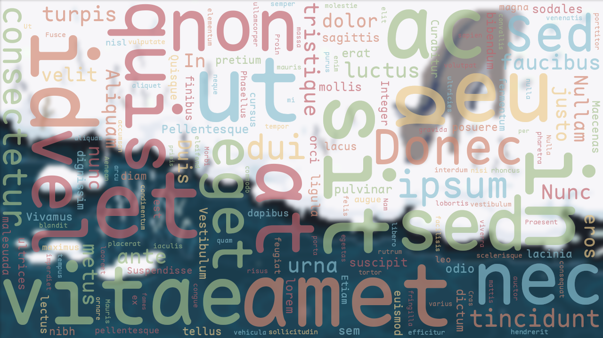

A C# word cloud generator, algorithm based on this [blog post](https://peekaboo-vision.blogspot.com/2012/11/a-wordcloud-in-python.html), with minor improvements.

---

## Usage

```csharp
using var cloud = new WordCloudBuilder()
    .WithSize(800, 600)
    .WithPadding(5)
    .Build()

var dict = File.ReadAllText("path/to/your/text/file.txt")
               .Split(' ', StringSplitOptions.RemoveEmptyEntries)
               .Where(w => w.All(char.IsLetter))
               .GroupBy(w => w)
               .ToDictionary(g => g.Key, g => g.Count());

using var image = cloud.GenerateImage(dict);
using var stream = File.OpenWrite("path/to/your/output/image.png");
image.Encode().SaveTo(stream);
```

## Example

see [example](https://github.com/CrackTC/WordCloud/tree/main/example)



## License

MIT
